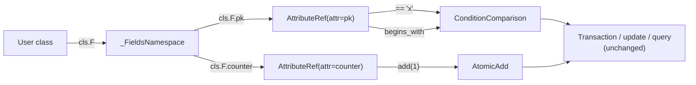

# PR 3: `cls.F` condition / atomic namespace

**Summary**: add a `cls.F` namespace exposing one `AttributeRef` per field.
`AttributeRef` carries the condition and atomic operators currently defined
directly on `Attribute`. Both styles work after this PR on `Model`. No
deprecation warnings.

## Motivation

Today `User.pk == "x"` works because `Attribute` is a class-level descriptor
whose `__eq__` returns a `ConditionComparison`. That depends on class-level
field access returning the descriptor itself.

PR 4 introduces an opt-in `PydanticModel(Model, BaseModel)` class. On a
Pydantic `BaseModel` subclass, class-level `User.pk` is a `FieldInfo` (or
raises `AttributeError`) - Pydantic owns that namespace, and the operator
overloads cannot run. `PydanticModel` therefore needs a different access
path for conditions and atomic operations.

This PR introduces the replacement access path, `cls.F.pk`, available on
both `Model` and `PydanticModel`. On `Model` it is a sibling to the
existing descriptor syntax: users can pick whichever they prefer. On
`PydanticModel` it is the only way to build conditions and atomics.

The implementation delegates to the exact same `Condition*` and `Atomic*`
classes used today, so downstream code (transactions, update, query, scan)
does not change.

## Scope

In:

- A new `AttributeRef` class (module
  `python/pydynox/_internal/_model/_refs.py`) wrapping an underlying
  `Attribute`. Exposes:
  - Comparison operators (`__eq__`, `__ne__`, `__lt__`, `__le__`, `__gt__`,
    `__ge__`) returning `ConditionComparison`.
  - `exists()`, `not_exists()`, `begins_with()`, `contains()`, `between()`,
    `is_in()`, `__getitem__` (for nested map / list paths).
  - `set()`, `add()`, `remove()`, `append()`, `prepend()`, `if_not_exists()`.
- A `_FieldsNamespace` exposing one `AttributeRef` per entry in
  `cls._attributes`, accessible as `cls.F` (both class-level and
  instance-level; both return the same namespace).
- `cls.F["pk"]` string lookup for dynamic builders.

Out:

- Introducing `PydanticModel`. PR 4.
- Deprecating or removing the descriptor-style operators on `Model`.
  Not scheduled. The descriptor style stays a first-class citizen on
  `Model` indefinitely. Documentation recommends `cls.F` as the canonical
  path but does not nag users who prefer `User.pk == "x"`.

## Design



`AttributeRef` is constructed with the underlying `Attribute` and delegates
to the existing condition/atomic builders in
[python/pydynox/_internal/_conditions.py](../../../python/pydynox/_internal/_conditions.py)
and [python/pydynox/_internal/_atomic.py](../../../python/pydynox/_internal/_atomic.py).

`_FieldsNamespace` is lazy: it is built once per class in
`ModelMeta.__new__` after `_attributes` is populated, and memoized on
`cls._F_namespace`. The same population runs for `PydanticModel` via the
combined metaclass in PR 4.

## Files touched

- New `python/pydynox/_internal/_model/_refs.py` - `AttributeRef` and
  `_FieldsNamespace`.
- [python/pydynox/_internal/_model/_base.py](../../../python/pydynox/_internal/_model/_base.py)
  - at the end of `ModelMeta.__new__` (after index binding, around line
  167), build and attach the `F` namespace:
  `cls.F = _FieldsNamespace(cls._attributes)`.
- [python/pydynox/__init__.py](../../../python/pydynox/__init__.py) - export
  `AttributeRef` for type annotations.
- [tests/](../../../tests/) - parity tests (descriptor-style vs `cls.F`)
  and string-lookup tests.
- [docs/guides/](../../../docs/guides/) - update the conditions guide to
  recommend `cls.F.*` and show both styles work on `Model`.

## Public API changes

### Conditions

Before:

```python
from pydynox.conditions import Condition

users = User.sync_query(
    partition_key="TENANT#1",
    sort_key_condition=User.sk.begins_with("USER#"),
    filter_condition=(User.status == "active") & (User.age > 18),
)
```

After (old keeps working, new is the documented style):

```python
users = User.sync_query(
    partition_key="TENANT#1",
    sort_key_condition=User.F.sk.begins_with("USER#"),
    filter_condition=(User.F.status == "active") & (User.F.age > 18),
)
```

### Atomic updates

Before:

```python
await user.update_by_key(
    pk="USER#1",
    counter=User.counter.add(1),
    tags=User.tags.append(["premium"]),
    cache_key=User.cache_key.if_not_exists("default"),
)
```

After:

```python
await user.update_by_key(
    pk="USER#1",
    counter=User.F.counter.add(1),
    tags=User.F.tags.append(["premium"]),
    cache_key=User.F.cache_key.if_not_exists("default"),
)
```

### String lookup

New, useful for dynamic builders:

```python
def build_filter(field: str, value: Any) -> Condition:
    return User.F[field] == value
```

## Back-compat and deprecation notes

- **All existing code keeps working** after this PR. Nothing is removed.
- **No deprecation warnings** are emitted for descriptor-style operators.
  The previous plan wired a `DeprecationWarning` on `User.pk == "x"`; that
  has been dropped because `Model` is no longer scheduled for a `BaseModel`
  cutover, and the descriptor style will keep working indefinitely.
- On `PydanticModel` (PR 4), `User.pk == "x"` is simply unavailable because
  Pydantic occupies class-level field access. `cls.F.pk == "x"` is the
  only supported form there, and that is a Pydantic constraint rather than
  a pydynox deprecation.

## Test plan

### Semantic parity

For every operator and atomic op, assert that the old and new forms produce
`Condition` / `AtomicOp` objects that serialize to byte-identical expression
strings:

```python
assert (User.pk == "x").serialize({}, {}) == (User.F.pk == "x").serialize({}, {})
```

Cover:

- Comparisons (`==`, `!=`, `<`, `<=`, `>`, `>=`).
- `exists`, `not_exists`, `begins_with`, `contains`, `between`, `is_in`.
- Boolean combinators (`&`, `|`, `~`).
- Nested path (`User.F.profile["address"]["city"] == "Berlin"`).
- Atomic ops (`set`, `add`, `remove`, `append`, `prepend`, `if_not_exists`).
- Aliased fields: `User.F.<py_name>` uses the DynamoDB alias in serialized
  output, matching today's behavior.

### No deprecation warning

- `warnings.catch_warnings()` around `User.pk == "x"` asserts no
  `DeprecationWarning` (or any pydynox-originated warning) is emitted.

### Dynamic lookup

- `User.F["pk"] == "x"` equals `User.F.pk == "x"`.
- `User.F["nonexistent"]` raises `KeyError` with a helpful message.

### Integration

Re-run the existing query / transaction / update integration tests with all
uses rewritten to `cls.F.*`; must pass identically. Run a shadow copy with
the original descriptor-style uses; must also pass identically with no
warnings.

## Size

M. Roughly 200-300 LOC added (`_refs.py` + wiring). Tests are the bulk.
No warning shim; no changes to
[python/pydynox/attributes/base.py](../../../python/pydynox/attributes/base.py)
operator methods.

## Depends on / unblocks

- Depends on: nothing hard, but lands after PR 1 and PR 2 so the docs
  examples already show the new `dynamodb_config` + `Annotated` style.
- Unblocks: PR 4. `PydanticModel` requires `cls.F.*` because Pydantic
  owns class-level field access on `BaseModel` subclasses.
