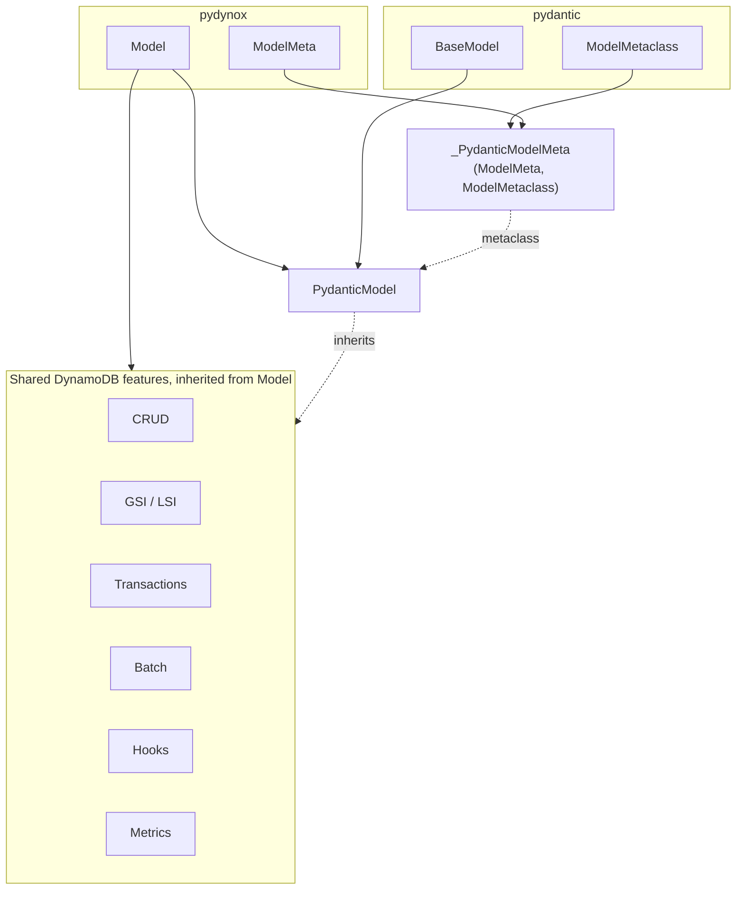

# PR 4: `PydanticModel` sibling class

**Summary**: introduce an opt-in `PydanticModel(Model, BaseModel)` class
that gives users Pydantic's data-modeling features on top of the full
pydynox DynamoDB feature set. `Model` is **not changed**. Pydantic stays
behind the `pydynox[pydantic]` extra. No breaking changes.

## Motivation

After PRs 1-3 the codebase has everything needed to layer Pydantic on top
of `Model` without touching `Model` itself:

- `dynamodb_config` (PR 1) keeps DynamoDB configuration out of Pydantic's
  reserved `model_config` name.
- `Annotated[T, Dynamo.*]` markers (PR 2) provide a declaration surface
  that Pydantic can parse.
- `cls.F.*` (PR 3) provides class-level condition / atomic operators that
  do not collide with Pydantic's `FieldInfo` ownership of class access.

This PR uses those pieces to build `PydanticModel`, an opt-in class that
inherits from both `Model` and `pydantic.BaseModel`. Users who want
Pydantic features (descriptions, validators, JSON schema,
`model_dump_json`, nested `BaseModel`) subclass `PydanticModel`. Everyone
else keeps using `Model` with zero changes.

`@dynamodb_model` (the legacy decorator path) is untouched in this PR.
Deprecation is a separate follow-up in PR 5.

## Scope

In:

- New module [python/pydynox/pydantic_model.py](../../../python/pydynox/pydantic_model.py)
  (~150-250 LOC). Lazily imports `pydantic`. Raises a clear `ImportError`
  if imported without Pydantic installed:
  `"PydanticModel requires pydantic. Install it with `pip install pydynox[pydantic]`."`
- Combined metaclass `_PydanticModelMeta(ModelMeta, ModelMetaclass)` that
  runs Pydantic's metaclass first (so `model_fields` is populated), then
  the pydynox collection pass (so `_attributes`, `_py_to_dynamo`,
  `_partition_key`, `_indexes`, `_hooks`, `_discriminator_registry` are
  populated from `model_fields` and `FieldInfo.metadata`).
- Class `PydanticModel(Model, BaseModel, metaclass=_PydanticModelMeta)`
  with:
  - Default `model_config = ConfigDict(validate_assignment=True, ...)`.
  - `__setattr__` override that delegates to `BaseModel.__setattr__` first
    (so Pydantic validation runs) and then updates `_original` /
    `_changed_fields` the way `ModelBase` does today.
  - `to_dict(...)` / `from_dict(...)` shims that internally use
    `model_dump(mode="python", by_alias=True)` / `model_validate(...)` then
    apply the `Attribute.serialize` / `Attribute.deserialize` path for
    fields whose attribute class has custom transforms (encrypted,
    compressed, S3, datetime, enum, JSON, templates, aliases).
  - `@model_validator(mode="after")` that calls `_apply_auto_generate()`
    and `_build_template_keys()` so the existing key-building logic runs at
    the right point.
- A helper `_collect_dynamodb_schema(cls)` that walks `cls.model_fields`,
  reads each `FieldInfo.metadata` list for `Dynamo.*` markers (reusing the
  builder from PR 2), synthesizes `Attribute` instances, and populates the
  same class dunders that `ModelMeta` populates for `Model`.
- Export `PydanticModel` from [python/pydynox/__init__.py](../../../python/pydynox/__init__.py)
  behind a lazy import. `import pydynox` without Pydantic installed keeps
  working; only `from pydynox import PydanticModel` triggers the import.

Out:

- Changing anything on `Model`. `Model` stays exactly as today.
- Deprecating `@dynamodb_model`. That is PR 5.
- Removing the descriptor-style operators on `Model`. Not scheduled.
- Changing the Rust core or the DynamoDB wire format.

## Architecture



## Metaclass wiring

```python
from pydantic._internal._model_construction import ModelMetaclass
from pydynox._internal._model._base import ModelMeta

class _PydanticModelMeta(ModelMeta, ModelMetaclass):
    def __new__(mcs, name, bases, namespace, **kwargs):
        # 1. Let Pydantic run first: populates __pydantic_fields__,
        #    FieldInfo.metadata, validators, ConfigDict.
        cls = ModelMetaclass.__new__(mcs, name, bases, namespace, **kwargs)

        # 2. Skip for the PydanticModel base class itself.
        if namespace.get("__module__") == "pydynox.pydantic_model" \
                and name == "PydanticModel":
            return cls

        # 3. Walk model_fields + metadata, synthesize Attribute instances,
        #    populate pydynox class dunders identical to ModelMeta output.
        _collect_dynamodb_schema(cls)

        # 4. Bind indexes, build _F_namespace, register hooks.
        _bind_indexes(cls)
        _build_F_namespace(cls)
        _register_hooks(cls)

        return cls
```

The resulting class has exactly the same `_attributes`, `_py_to_dynamo`,
`_partition_key`, `_sort_key`, `_indexes`, `_local_indexes`, `_hooks`,
`_discriminator_attr`, `_discriminator_registry` structure that `Model`
subclasses have, so every consumer in
[python/pydynox/_internal/](../../../python/pydynox/_internal/) and
[python/pydynox/model.py](../../../python/pydynox/model.py) works without
modification.

## `__setattr__` cooperation with `validate_assignment`

`Model` today tracks changes in `__setattr__` (see
[python/pydynox/_internal/_model/_base.py](../../../python/pydynox/_internal/_model/_base.py)).
Pydantic's `BaseModel.__setattr__` runs validation when
`validate_assignment=True` and stores values in `__dict__`.

`PydanticModel.__setattr__` orchestrates both:

```python
def __setattr__(self, name: str, value: Any) -> None:
    if name.startswith("_"):
        object.__setattr__(self, name, value)
        return

    attr = type(self)._attributes.get(name)

    # Capture "before" for dirty tracking.
    had_value = name in self.__dict__
    old = self.__dict__.get(name)

    # Let pydantic validate and assign; this may raise ValidationError.
    BaseModel.__setattr__(self, name, value)

    # Update change tracking on success.
    if attr is not None and (not had_value or old != self.__dict__[name]):
        self._changed_fields.add(name)
        self._original.setdefault(name, old)
```

Regression tests cover:

- Assigning an invalid value raises `ValidationError` and does not pollute
  `_changed_fields`.
- Assigning a valid value updates both `__dict__` and `_changed_fields`.
- Assigning the same value twice only records it once in `_changed_fields`.
- `validate_assignment=False` still updates `_changed_fields` as expected.

## `to_dict` / `from_dict`

Kept as the public API for symmetry with `Model` and to preserve call sites
in the codebase (CRUD, transactions, batch). Internally they delegate:

```python
def to_dict(self, *, for_dynamo: bool = True) -> dict[str, Any]:
    # 1. Pydantic dumps to python objects using aliases.
    raw = self.model_dump(mode="python", by_alias=True)

    # 2. Apply Attribute.serialize for fields needing custom wire format
    #    (encryption, compression, S3 offload, datetime formatting, enum
    #    value, JSON wrapping, templated keys).
    for py_name, attr in type(self)._attributes.items():
        dynamo_name = type(self)._py_to_dynamo[py_name]
        if attr.needs_custom_serialize():
            raw[dynamo_name] = attr.serialize(getattr(self, py_name))

    # 3. Build templated partition/sort keys.
    raw.update(type(self)._build_template_keys(self))
    return raw
```

`from_dict` is the inverse: apply `Attribute.deserialize` first, then
`cls.model_validate(...)` so Pydantic validators run on the normalized
values.

## Public API

```python
from typing import Annotated, ClassVar
from pydantic import ConfigDict, Field, field_validator
from pydynox import PydanticModel, DynamoConfig, Dynamo

class Order(PydanticModel):
    dynamodb_config: ClassVar[DynamoConfig] = DynamoConfig(table="orders")
    model_config = ConfigDict(validate_assignment=True, extra="forbid")

    pk:          Annotated[str, Dynamo.PartitionKey(template="ORDER#{order_id}")]
    order_id:    Annotated[str, Dynamo.AutoGen(AutoGenerate.ULID)]
    customer_id: str = Field(description="Customer identifier")
    total_cents: int = Field(ge=0, description="Total in USD cents")
    status:      Annotated[OrderStatus, Dynamo.Enum(OrderStatus)]

    @field_validator("customer_id")
    @classmethod
    def _normalize_customer(cls, v: str) -> str:
        return v.strip().lower()

# Works exactly like Model:
order = await Order(customer_id="ACME", total_cents=1999).save()
found = await Order.get(pk="ORDER#01HXYZ...")

# And with cls.F:
tx = Transaction()
tx.update(Order, key={"pk": order.pk}, atomic=[Order.F.total_cents.add(100)])
await tx.commit()

# Plus pydantic niceties:
schema = Order.model_json_schema()   # full JSON schema with descriptions
blob   = order.model_dump_json()     # JSON serialization
```

## Files touched

- New [python/pydynox/pydantic_model.py](../../../python/pydynox/pydantic_model.py)
  - `PydanticModel`, `_PydanticModelMeta`, `_collect_dynamodb_schema`,
  `_bind_indexes`, `_build_F_namespace`, `_register_hooks`,
  `__setattr__` cooperation with `validate_assignment`.
- [python/pydynox/__init__.py](../../../python/pydynox/__init__.py) - lazy
  `PydanticModel` export; no change to `import pydynox` when Pydantic is
  missing.
- [python/pydynox/_internal/_model/_base.py](../../../python/pydynox/_internal/_model/_base.py)
  - factor the collection pass used by `ModelMeta.__new__` into a helper
  so `_collect_dynamodb_schema` can reuse it. Pure refactor; `Model`
  behavior unchanged.
- [pyproject.toml](../../../pyproject.toml) - confirm `pydantic >= 2.5` in
  the `pydantic` extra.
- [docs/guides/pydantic.md](../../../docs/guides/pydantic.md) (new) -
  worked example for `PydanticModel` and a decision table for picking
  between `Model` and `PydanticModel`.
- [tests/unit/pydantic_model/](../../../tests/) (new directory) - parity
  suite and pydantic-specific tests.

## Test plan

Two layers.

### Parity suite

For every pydynox feature, run the same scenario on a `Model` subclass and
a `PydanticModel` subclass, and assert byte-identical wire format plus
equivalent observable behavior:

- Partition key, sort key, composite template keys.
- Aliases (`Dynamo.Alias` and `Field(alias=...)` cooperate).
- GSI and LSI query; INCLUDE projection.
- Transactions: `put`, `update`, `delete`, `condition_check`.
- Batch read / write.
- Hooks (`@before_save`, `@after_get`, ...).
- Atomic updates via `cls.F.*`.
- Discriminator reads / writes.
- TTL, Version (conflict path).
- Encrypted, Compressed, S3 offload.
- AutoGenerate (ULID, UUID4, created_at, updated_at).
- Dirty tracking: `is_dirty`, `changed_fields`, save-skip when clean.

### Pydantic-specific tests

- `Field(description=..., examples=..., json_schema_extra=...)` appears in
  `Order.model_json_schema()`.
- `@field_validator` rejects invalid input during `save()` with
  `ValidationError`; nothing is written.
- `validate_assignment=True` + dirty tracking: valid assignment updates
  `_changed_fields`; invalid assignment raises and does not.
- Nested `BaseModel` fields round-trip through DynamoDB (stored as a JSON
  map, `model_validate` on read).
- `@dynamodb_model` to `PydanticModel` migration: a paired class pair with
  equivalent declarations produces equivalent `save` / `get` behavior.
  Used by the PR 5 migration guide.
- Import side effects: `import pydynox` with Pydantic uninstalled must not
  fail; `from pydynox import PydanticModel` with Pydantic uninstalled must
  raise a clear `ImportError` naming the extra.

## Size

M. Roughly 400-600 LOC new code (most of it in `pydantic_model.py`),
800-1200 LOC of tests (parity matrix is large). No files removed; no code
path removed from `Model`.

## Depends on / unblocks

- Depends on: PR 1 (name `dynamodb_config`), PR 2 (`Annotated` markers),
  PR 3 (`cls.F` namespace).
- Unblocks: PR 5 (deprecate `@dynamodb_model` and point users at
  `PydanticModel`).
