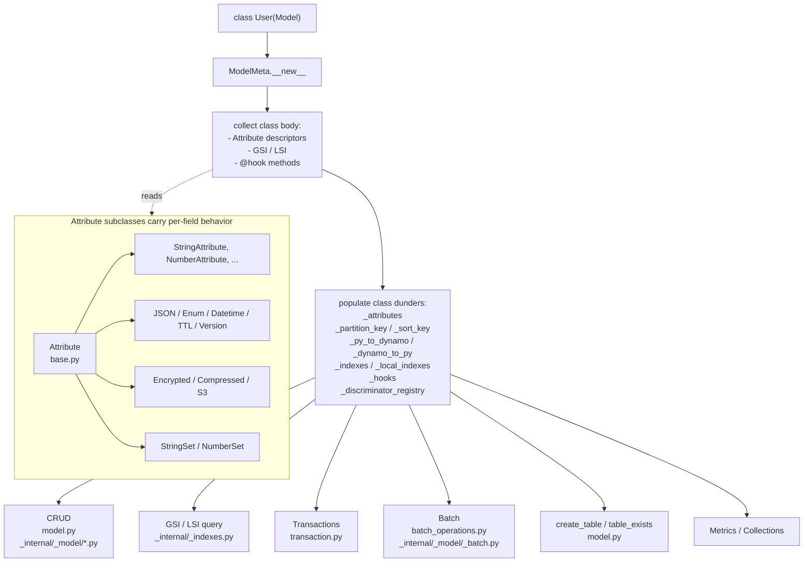
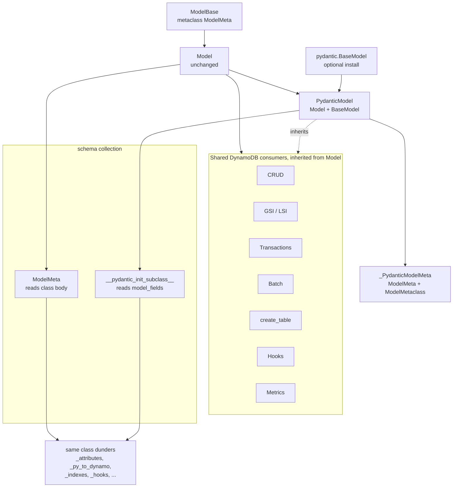

# Overview: Optional Pydantic integration via `PydanticModel`

## Executive summary

pydynox's `Model` today is a hand-rolled schema system built on class-body
`Attribute` descriptors. It gives users a rich DynamoDB-aware API but no
Pydantic ergonomics: you cannot attach `Field(description=...)`, you cannot
add a `@field_validator`, you cannot emit a JSON schema, you cannot nest
ordinary `BaseModel`s.

The **sibling decorator path** (`@dynamodb_model` in
[python/pydynox/integrations/pydantic.py](../../../python/pydynox/integrations/pydantic.py))
gives you a real `BaseModel` but strips almost every DynamoDB feature:
no aliases, no templates, no indexes, no hooks, no encryption, no TTL, no
version, no discriminator, no atomic ops, no conditions, no `ModelConfig`.

This refactor resolves the gap **without forcing Pydantic on users who do
not want it**. `Model` stays exactly as today. A new opt-in
`PydanticModel(Model, BaseModel)` class gives Pydantic users the full
DynamoDB feature set plus everything Pydantic provides. Pydantic itself
stays behind the `pydynox[pydantic]` extra.

## Motivation

Concrete pain points this refactor addresses, for users who opt into
Pydantic:

1. **Docs and schema**: `Field(description=..., examples=..., json_schema_extra=...)`
   for OpenAPI / MkDocs / admin UIs.
2. **Validation**: `Field(pattern=..., ge=..., max_length=...)` and
   `@field_validator` / `@model_validator` without writing custom Attribute
   subclasses.
3. **Serialization**: `model_dump_json()` / `model_validate_json()` out of
   the box, without the current JSON re-serialization dance.
4. **Nested models**: a Pydantic `BaseModel` can contain another `BaseModel`
   directly; today you need `JSONAttribute[SomeModel]` and extra plumbing.
5. **One canonical way for Pydantic users**: removes the recurring "should
   I subclass `Model` or use `@dynamodb_model`?" question by deprecating
   the decorator in favor of `PydanticModel`.

Users who do not want Pydantic see no dependency change and no API change
beyond the additive `cls.F` namespace and the optional `dynamodb_config`
attribute name.

## Current architecture



Key properties we want to keep:

- Downstream consumers (CRUD, GSI/LSI, transactions, batch, table ops,
  metrics, hooks) read **only** the class dunders. They never touch the
  descriptor protocol.
- `Attribute.serialize` / `deserialize` is the only per-field customization
  point that matters for DynamoDB wire format.
- Indexes (`GlobalSecondaryIndex` / `LocalSecondaryIndex`) are plain class
  attributes that `__set_name__` / `_bind_to_model` wire up.

## Target architecture



Invariants after the refactor:

- `Model` runs unchanged. Its existing users see zero behavior change.
- `PydanticModel` populates the same class dunders `Model` consumers rely
  on, so CRUD, GSI/LSI, transactions, batch, hooks, metrics, and
  `create_table` all work without any changes to those modules.
- The same internal `Attribute` subclasses run for both `Model` and
  `PydanticModel`. Nothing about the wire format changes.
- Pydantic is imported lazily only when `PydanticModel` is imported.

## Feature mapping

| Feature | `Model` (today and after) | `PydanticModel` (opt-in) |
|---------|---------------------------|--------------------------|
| Field declaration | Class-body `Attribute` descriptors OR `Annotated[T, Dynamo.*]` (after PR 2) | `Annotated[T, Dynamo.*]` + `Field(...)` only |
| DynamoDB config | `model_config = ModelConfig(...)` OR `dynamodb_config: ClassVar[DynamoConfig]` | `dynamodb_config: ClassVar[DynamoConfig]` (pydantic owns `model_config`) |
| Pydantic config | n/a | `model_config = ConfigDict(...)` |
| Conditions / atomic ops | `User.pk == "x"` OR `User.F.pk == "x"` (after PR 3) | `User.F.pk == "x"` only (pydantic owns class access) |
| `Field(description=...)`, validators, JSON schema | no | yes |
| `model_dump_json()` / `model_validate_json()` | no | yes |
| Nested `BaseModel` as a field | via `JSONAttribute[M]` | native |
| GSI / LSI, composite keys, INCLUDE projection | yes | yes (inherited) |
| Aliases, templates, AutoGenerate | yes | yes (inherited) |
| Encrypted / Compressed / S3 / Version / TTL / Sets / JSON / Enum / Datetime | yes | yes (inherited) |
| Discriminator, hooks, metrics, collections, transactions, batch | yes | yes (inherited) |
| Dirty tracking (`is_dirty`, `changed_fields`) | yes | yes, cooperates with `validate_assignment` |

## Naming: `dynamodb_config` vs `model_config`

Pydantic v2 reserves `model_config` on every `BaseModel` subclass. Its type
is `ConfigDict`, and `ModelMetaclass` inspects it at class creation time.
Assigning a `ModelConfig(table="users")` dataclass there would either be
shadowed, rejected, or silently misread on `PydanticModel`.

The refactor introduces `dynamodb_config` as the canonical name for
pydynox's per-model configuration on both classes:

```python
from typing import Annotated, ClassVar
from pydantic import ConfigDict, Field
from pydynox import PydanticModel, DynamoConfig, Dynamo

class User(PydanticModel):
    # pydynox configuration
    dynamodb_config: ClassVar[DynamoConfig] = DynamoConfig(table="users")
    # pydantic configuration, untouched
    model_config = ConfigDict(validate_assignment=True)

    pk:   Annotated[str, Dynamo.PartitionKey()] = Field(description="User PK")
    name: str = Field(description="Display name")
```

`Model` users are free to keep using `model_config = ModelConfig(...)`,
though migrating to `dynamodb_config` is documented as the canonical name.
PR 1 handles the rename with a one-release `DeprecationWarning` on the old
name to keep docs consistent; removal is not scheduled.

## Why `cls.F` for conditions and atomics

Today `Attribute` is a class-level descriptor. `User.pk` returns the
`Attribute`, and `User.pk == "x"` returns a `ConditionComparison` via
[attributes/base.py](../../../python/pydynox/attributes/base.py).

Under Pydantic, class-level `User.pk` is a `FieldInfo` (or `AttributeError`)
and the operator overloads are unavailable. `PydanticModel` cannot support
the descriptor syntax at all.

PR 3 adds a sibling namespace available on both classes:

```python
# Model (both styles work; choose one)
cond = User.pk == "USER#1"
cond = User.F.pk == "USER#1"

# PydanticModel (only F works)
cond = PyUser.F.pk == "USER#1"
op   = PyUser.F.counter.add(1)
```

`cls.F` is built lazily from `_attributes`. Each entry is an `AttributeRef`
wrapping the underlying `Attribute` and exposing the same operator
overloads and atomic helpers. Downstream consumers (`Transaction`,
`AsyncModelQueryResult`, `update_item`, ...) already accept `Condition` and
`AtomicOp` objects and therefore need no changes.

`Model` keeps descriptor-style conditions indefinitely. No deprecation
warning, no removal.

## Rollout

All five PRs ship on minor versions. No breaking changes.

```mermaid
gantt
    title Refactor rollout (all minor versions, non-breaking)
    dateFormat X
    axisFormat %s

    section Non-breaking prep
    PR1 DynamoConfig rename     : 0, 1
    PR2 Annotated markers       : 1, 2
    PR3 cls.F namespace         : 2, 3

    section Opt-in Pydantic
    PR4 PydanticModel           : 3, 4

    section Cleanup
    PR5 Deprecate decorator     : 4, 5
```



- **PRs 1-3** are useful regardless of Pydantic. Users gain new syntax;
  nothing old goes away.
- **PR 4** adds `PydanticModel` as an opt-in sibling. Users opt in by
  `from pydynox import PydanticModel` and subclassing it. No change for
  `Model` users.
- **PR 5** deprecates `@dynamodb_model` and points users at
  `PydanticModel`.

## Test strategy

Per PR, the test additions are described in each PR doc. A few
cross-cutting rules:

- Existing `Model` integration tests must pass unchanged after every PR.
  They are the regression bar for "did we accidentally affect `Model`
  users?".
- For PR 4, add a **parity suite**: for every DynamoDB feature
  (GSI/LSI, templates, encrypted, S3 offload, version conflict, TTL,
  discriminator, dirty tracking, auto-generate, hooks), run the same
  scenario once on a `Model` subclass and once on a `PydanticModel`
  subclass. Assert byte-identical wire format and equivalent observable
  behavior.
- New in PR 4: parity tests for Pydantic-side features
  (`Field(description=...)` appears in `model_json_schema()`,
  `@field_validator` rejects bad input during `save()`, nested `BaseModel`
  round-trips through DynamoDB, `validate_assignment=True` still triggers
  dirty-tracking correctly).
- New in PR 3: `User.F.pk == "x"` produces a `ConditionComparison` that
  serializes identically to today's `User.pk == "x"`.

## Risk matrix

| Risk | Impact | Likelihood | Mitigation |
|------|--------|------------|------------|
| Dirty tracking breaks on `PydanticModel` under `validate_assignment` | High | Medium | `PydanticModel.__setattr__` delegates to `BaseModel.__setattr__` first, then updates `_original`/`_changed`; dedicated regression tests in PR 4 |
| Template PK build ordering (auto-gen vs template) on `PydanticModel` | Medium | Medium | Reuse existing `_apply_auto_generate` + `_build_template_keys`, invoked from a `@model_validator(mode="after")` and from `save()`; covered by parity tests |
| Metaclass conflict when a user's own `ModelMetaclass` subclass collides | Low | Low | Document `_PydanticModelMeta` composition and expose it so power users can extend it |
| Pydantic version float | Medium | Low | Pin a minimum Pydantic version (`>= 2.5`) in the `pydynox[pydantic]` extra; document in [.ai/dependencies.md](../../../.ai/dependencies.md) |
| `Field(alias=...)` collision with pydynox alias semantics | Medium | Low | PR 4 maps `FieldInfo.alias` -> `_py_to_dynamo` / `_dynamo_to_py`; unit tests compare dunders against a `Model` equivalent |
| Users forgetting they need `pydynox[pydantic]` extra | Low | Medium | Lazy import + clear `ImportError` message naming the extra |
| Doc split between `Model` and `PydanticModel` | Low | High | Single overview + a decision chart in docs: "Do you want Pydantic? -> `PydanticModel`. Else -> `Model`." |

## Out of scope for this refactor

- Schema migrations. The on-disk DynamoDB format does not change.
- Changing anything in the Rust core ([src/](../../../src/)).
- Changing the `DynamoDBClient` low-level API.
- Modifying `Model` to use pydantic internally. `Model` stays dependency-free.
- Replacing the internal `Attribute` subclasses. They remain as the runtime
  representation for both `Model` and `PydanticModel`.

## Open questions

Tracked explicitly here so each PR does not re-litigate them:

1. Should `Dynamo.*` markers be dataclasses or Pydantic `BaseModel` themselves?
   Proposed: plain `@dataclass(frozen=True)` for speed and no dependency on
   Pydantic (so `Model` users can use them too). Decide in PR 2.
2. Should the `cls.F` namespace support `User.F["pk"]` string lookup?
   Proposed: yes, useful for dynamic builders. Decide in PR 3.
3. Should `PydanticModel` keep `to_dict()` / `from_dict()` as the public
   API, or migrate to `model_dump(by_alias=True)` / `model_validate()`
   directly? Proposed: keep `to_dict` / `from_dict` as thin wrappers to
   stay call-compatible with `Model`. Decide in PR 4.
4. Should we expose a `PyDataclassModel` for pydantic dataclasses later?
   Proposed: not now. Revisit only if the community asks for it.
