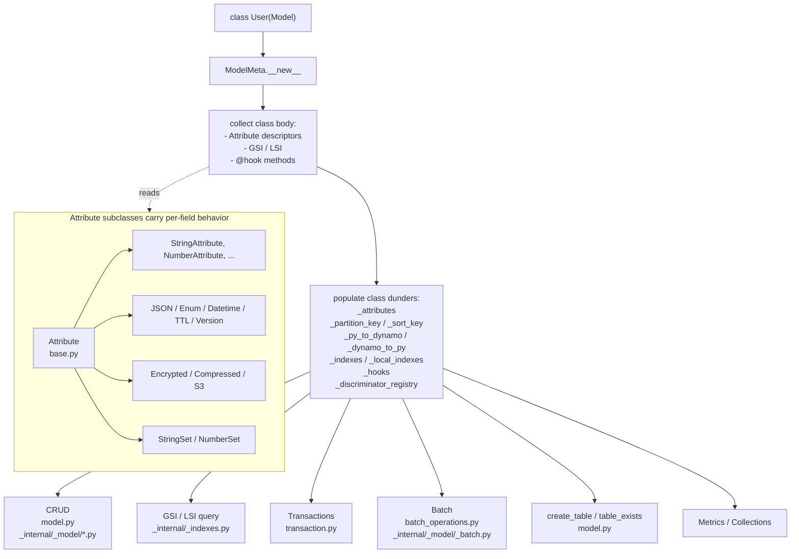
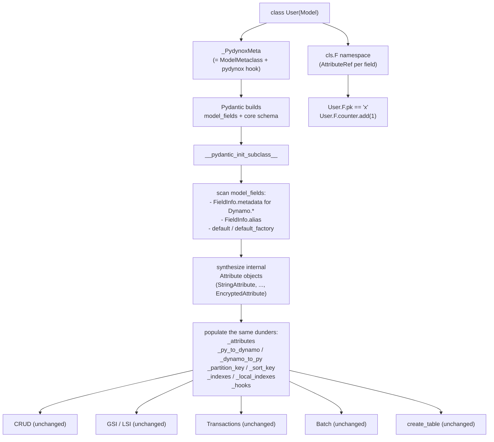

# Overview: Pydantic BaseModel Refactor

## Executive summary

pydynox's `Model` today is a hand-rolled schema system built on class-body
`Attribute` descriptors. It gives users a rich DynamoDB-aware API but no
Pydantic ergonomics: you cannot attach `Field(description=...)`, you cannot
add a `@field_validator`, you cannot emit a JSON schema, you cannot nest
ordinary `BaseModel`s.

The **sibling decorator path** (`@dynamodb_model` in
[python/pydynox/integrations/pydantic.py](../../../python/pydynox/integrations/pydantic.py))
gives you a real `BaseModel` but strips almost every DynamoDB feature:
no aliases, no templates, no indexes, no hooks, no encryption, no TTL, no
version, no discriminator, no atomic ops, no conditions, no `ModelConfig`.

This refactor unifies both worlds by making `Model` itself a `pydantic.BaseModel`
subclass, without losing any DynamoDB feature.

## Motivation

Concrete user pain that this refactor resolves:

1. **Docs and schema**: `Field(description=..., examples=..., json_schema_extra=...)`
   for OpenAPI / MkDocs / admin UIs.
2. **Validation**: `Field(pattern=..., ge=..., max_length=...)` and
   `@field_validator` / `@model_validator` without writing custom Attribute
   subclasses.
3. **Serialization**: `model_dump_json()` / `model_validate_json()` out of
   the box, without the current JSON re-serialization dance.
4. **Nested models**: a Pydantic `BaseModel` can contain another `BaseModel`
   directly; today you need `JSONAttribute[SomeModel]` and extra plumbing.
5. **One canonical way**: removes the recurring "should I subclass `Model`
   or use `@dynamodb_model`?" question.

## Current architecture



Key properties of the existing layout that we want to keep:

- Downstream consumers (CRUD, GSI/LSI, transactions, batch, table ops,
  metrics, hooks) read **only** the class dunders. They never touch the
  descriptor protocol.
- `Attribute.serialize` / `deserialize` is the only per-field customization
  point that matters for DynamoDB wire format.
- Indexes (`GlobalSecondaryIndex` / `LocalSecondaryIndex`) are plain class
  attributes that `__set_name__` / `_bind_to_model` wire up. They do not
  participate in Pydantic's field system at all.

## Target architecture



Invariants after the refactor:

- The same internal `Attribute` subclasses run. Nothing about the wire
  format or the DynamoDB feature set changes.
- The same class dunders exist and mean the same thing, so every consumer
  module is untouched.
- The only user-visible changes are the declaration syntax and the
  condition/atomic access path.

## Feature-by-feature mapping

| Feature | Today (source) | After refactor | Risk |
|---------|----------------|----------------|------|
| Partition / sort key flag | `StringAttribute(partition_key=True)` in [attributes/base.py](../../../python/pydynox/attributes/base.py) | `Annotated[str, Dynamo.PartitionKey()]` | Low |
| Alias (short DynamoDB name) | `Attribute(alias="PK")` | `Field(alias="PK")` (native Pydantic) | Low |
| Template keys (`USER#{email}`, t-strings) | `StringAttribute(template=...)` in [attributes/primitives.py](../../../python/pydynox/attributes/primitives.py) | `Dynamo.PartitionKey(template=...)` | Low |
| AutoGenerate (`ULID`, `UUID4`, `EPOCH`, ...) | `default=AutoGenerate.ULID` in [generators.py](../../../python/pydynox/generators.py) | `Dynamo.AutoGen(AutoGenerate.ULID)` or unchanged `default=` | Low |
| JSON / Enum / Datetime | `JSONAttribute[M]` / `EnumAttribute[E]` / `DatetimeAttribute` in [attributes/special.py](../../../python/pydynox/attributes/special.py) | Keep internally; surface via `Dynamo.JSON(...)`, native nested `BaseModel`, Pydantic enum validation | Low |
| Encrypted (KMS envelope) | `EncryptedAttribute` in [attributes/encrypted.py](../../../python/pydynox/attributes/encrypted.py) | `Annotated[str, Dynamo.Encrypted(key_id=...)]` | Low |
| Compressed | `CompressedAttribute` in [attributes/compressed.py](../../../python/pydynox/attributes/compressed.py) | `Annotated[bytes, Dynamo.Compressed()]` | Low |
| S3 offload | `S3Attribute` + lifecycle in [_internal/_model/_s3_helpers.py](../../../python/pydynox/_internal/_model/_s3_helpers.py) | `Annotated[..., Dynamo.S3(...)]`; lifecycle iterates `_attributes` as today | Low |
| Version (optimistic lock) | `VersionAttribute` + `_build_version_condition` in [_internal/_model/_version.py](../../../python/pydynox/_internal/_model/_version.py) | `Annotated[int, Dynamo.Version()]` | Low |
| TTL (`is_expired`, `extend_ttl`) | `TTLAttribute` + [_internal/_model/_ttl.py](../../../python/pydynox/_internal/_model/_ttl.py) | `Annotated[datetime, Dynamo.TTL(...)]` | Low |
| String / Number sets | `StringSetAttribute` / `NumberSetAttribute` in [attributes/sets.py](../../../python/pydynox/attributes/sets.py) | `Annotated[set[str], Dynamo.StringSet()]` | Low |
| Discriminator | `attr.discriminator=True` + `_discriminator_registry` in [_internal/_model/_base.py](../../../python/pydynox/_internal/_model/_base.py) | `Annotated[..., Dynamo.Discriminator()]`; optionally also Pydantic native discriminated unions | Low |
| GSI (composite up to 4 attrs, INCLUDE / KEYS_ONLY / ALL) | `GlobalSecondaryIndex` class attribute in [_internal/_indexes.py](../../../python/pydynox/_internal/_indexes.py) | Unchanged (not a field, just a class attribute) | Low |
| LSI | `LocalSecondaryIndex` same pattern | Unchanged | Low |
| Conditions (`==`, `begins_with`, `between`, `contains`, `exists`, `&` / \| / `~`) | Operators on `Attribute` in [attributes/base.py](../../../python/pydynox/attributes/base.py) | Move to `AttributeRef` under `cls.F` | **Medium** (API break) |
| Atomic ops (`add`, `append`, `prepend`, `if_not_exists`, ...) | Methods on `Attribute` | Move to `AttributeRef` under `cls.F` | **Medium** (API break) |
| Transactions | [transaction.py](../../../python/pydynox/transaction.py) | Unchanged | Low |
| Batch ops | [batch_operations.py](../../../python/pydynox/batch_operations.py), [_internal/_model/_batch.py](../../../python/pydynox/_internal/_model/_batch.py) | Unchanged | Low |
| Hooks (`BEFORE_SAVE`, `AFTER_LOAD`, ...) | [hooks.py](../../../python/pydynox/hooks.py) + `ModelMeta` collection | Unchanged collection, run the same way | Low |
| Dirty tracking (`is_dirty`, `changed_fields`) | `__setattr__` + `_original` / `_changed` in [_internal/_model/_base.py](../../../python/pydynox/_internal/_model/_base.py) | Cooperate with Pydantic's `validate_assignment`; keep `__setattr__` hook but call `super().__setattr__` first | **Medium** (subtle) |
| `create_table` / `table_exists` / `delete_table` | [model.py](../../../python/pydynox/model.py) | Unchanged, reads the same dunders | Low |
| Metrics, hot-partition overrides | [_internal/_metrics.py](../../../python/pydynox/_internal/_metrics.py), `ModelConfig` | `DynamoConfig` rename; otherwise unchanged | Low |
| `ModelConfig` naming | [config.py](../../../python/pydynox/config.py) as `model_config` class attr | Rename class attribute to `dynamodb_config`; `ModelConfig` -> `DynamoConfig` alias | Low |

## Naming collision: `model_config`

Pydantic v2 reserves `model_config` on every `BaseModel` subclass. Its type
is `ConfigDict`, and `ModelMetaclass` inspects it at class creation time.
Assigning a `ModelConfig(table="users")` dataclass there would either be
shadowed, rejected, or silently misread.

The refactor uses a different attribute name:

```python
class User(Model):
    dynamodb_config: ClassVar[DynamoConfig] = DynamoConfig(table="users")

    model_config = ConfigDict(validate_assignment=True)  # pydantic's, untouched
```

Back-compat: PR 1 makes `model_config = ModelConfig(...)` still work with a
`DeprecationWarning`, before any `BaseModel` behavior arrives in PR 4.

## The `User.pk` break

Today `Attribute` is a class-level descriptor. `User.pk` returns the
`Attribute`, and `User.pk == "x"` returns a `ConditionComparison` via
[attributes/base.py](../../../python/pydynox/attributes/base.py).

Under Pydantic, class-level `User.pk` is a `FieldInfo` (or `AttributeError`).
We introduce a sibling namespace:

```python
# before
cond = User.pk == "USER#1"
op   = User.counter.add(1)

# after (PR 3 adds this, PR 4 removes the old syntax)
cond = User.F.pk == "USER#1"
op   = User.F.counter.add(1)
```

`User.F` is built lazily from `_attributes`. Each entry is an `AttributeRef`
wrapping the underlying `Attribute` and exposing the same operator overloads
and atomic helpers. Downstream consumers (`Transaction`,
`AsyncModelQueryResult`, `update_item`, ...) already accept `Condition` and
`AtomicOp` objects and therefore need no changes.

Shim (PR 3, dropped in PR 4): `User.pk` still returns an object whose
operators work like today, but emits a `DeprecationWarning`.

## Rollout

```mermaid
gantt
    title Refactor rollout
    dateFormat X
    axisFormat %s

    section Non-breaking (minor)
    PR1 DynamoConfig rename     : 0, 1
    PR2 Annotated markers       : 1, 2
    PR3 cls.F namespace         : 2, 3

    section Breaking (major)
    PR4 BaseModel cutover       : 3, 4

    section Cleanup (minor)
    PR5 Deprecate decorator     : 4, 5
```



- **PRs 1-3** ship on minor versions. Every feature keeps working; new
  syntax is additive; deprecation warnings start pointing users at the
  new style.
- **PR 4** is the only breaking change. It ships on a major version.
  The descriptor class-body style is removed; `User.pk` no longer resolves
  to an `Attribute`; `User.F.pk` is the only path.
- **PR 5** cleans up after PR 4 once users have had a chance to migrate,
  formally deprecating `@dynamodb_model` and retiring docs/examples that
  use the old style.

## Test strategy

Per PR, the test additions are described in each PR doc. A few cross-cutting
rules:

- Before PR 4, add an end-to-end snapshot suite in [tests/](../../../tests/)
  that exercises every combination of features (GSI composite, template
  PK, encrypted + S3 field, version + optimistic locking conflict, TTL
  expiry, discriminator round-trip, dirty tracking across `get()` ->
  `setattr` -> `save()`, ...). This suite must pass identically before and
  after the cutover.
- New in PR 4: parity tests for Pydantic-side features
  (`Field(description=...)` appears in `model_json_schema()`,
  `@field_validator` rejects bad input during `save()`, nested `BaseModel`
  round-trips through DynamoDB, `validate_assignment=True` still triggers
  dirty-tracking correctly).
- New in PR 3: `User.F.pk == "x"` produces a `ConditionComparison` that
  serializes identically to today's `User.pk == "x"`.

## Risk matrix

| Risk | Impact | Likelihood | Mitigation |
|------|--------|------------|------------|
| Dirty tracking breaks under `validate_assignment` | High | Medium | Keep `__setattr__` hook; add regression tests in PR 4; delegate to `super().__setattr__` first |
| Template PK build ordering (auto-gen vs template) | Medium | Medium | Existing `_apply_auto_generate` + `_build_template_keys` call sites cover it; add tests |
| Users pinning `isinstance(User.pk, Attribute)` | Low | Low | Document in migration guide; `cls.F.pk` has `.attribute` accessor for power users |
| Pydantic version float | Medium | Low | Pin a minimum Pydantic version (>= 2.5) in PR 4; document in [.ai/dependencies.md](../../../.ai/dependencies.md) |
| `Field(alias=...)` collision with existing alias semantics | Medium | Low | Unit tests comparing `_py_to_dynamo` / `_dynamo_to_py` before and after |
| Nested `BaseModel` in a field: how do we serialize? | Medium | Medium | Use `model_dump(mode="json", by_alias=True)` inside `to_dict`; covered in PR 4 tests |
| `JSONAttribute[M]` vs native nested Pydantic | Low | Low | Both work; recommend native in docs post-PR 5 |

## Out of scope for this refactor

- Schema migrations. The on-disk DynamoDB format does not change.
- Changing anything in the Rust core ([src/](../../../src/)).
- Changing the `DynamoDBClient` low-level API.
- Replacing the internal `Attribute` subclasses with something else. They
  remain as the runtime representation; they just stop being typed into
  user class bodies.

## Open questions

Tracked explicitly here so each PR does not re-litigate them:

1. Should `Dynamo.*` markers be dataclasses or Pydantic `BaseModel` themselves?
   Proposed: plain `@dataclass(frozen=True)` for speed and zero Pydantic
   dependency cycle. Decide in PR 2.
2. Should the `cls.F` namespace also support `User.F["pk"]` string lookup?
   Proposed: yes, useful for dynamic builders. Decide in PR 3.
3. In PR 4, keep `to_dict()` / `from_dict()` as the public API, or migrate
   to `model_dump(by_alias=True)` / `model_validate()` directly? Proposed:
   keep `to_dict` / `from_dict` as thin wrappers to preserve every existing
   call site. Decide in PR 4.
